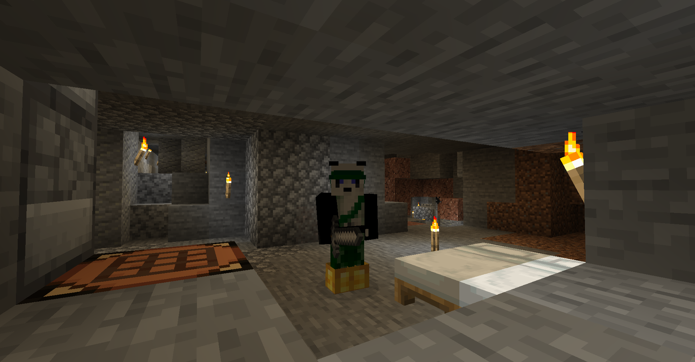
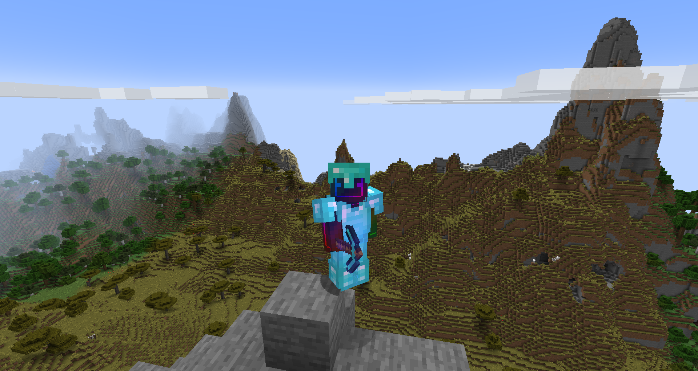

# pi_minecraft
A repo with links to guides to setup your own minecraft server on your pi, so that you can play with friends.    


The main guide I followed is linked [here](https://jamesachambers.com/raspberry-pi-minecraft-server-script-with-startup-service/). This fellow did a lot of work to figure out parameters for the minecraft server as well as various minecraft server versions to use to optimize minecraft. This will work best with a Pi 4 but also with a 3b+ or higher.

Once you've set up the server, you can open a port to your pi from your router setup using port forwarding. I have a guide to setup the pi [here](https://github.com/MZandtheRaspberryPi/pi_headless_setup#setup-port-forwarding-with-your-router) and you can use it to setup port forwarding. For minecraft you'll need to forward to port 25565 on your pi.     

You can check the external IP address of your router [here](https://www.whatismyip.com/) and look up the ipv4 address. That's what you'll give to your friends so they can connect!     

### Speeding up Server Startup

Note the startup script, start.sh, will check and try to download the specified version each time it is launched. This can take a fair amount of time, so you can comment out this and only uncomment it when you change the version and want to upgrade.

This would involve commenting out the wget lines in https://github.com/TheRemote/RaspberryPiMinecraft/blob/master/start.sh, the script provided to start up the server.
```
# Update paperclip.jar
# echo "Updating to most recent paperclip version ..."

# Test internet connectivity first
# wget --spider --quiet https://papermc.io/api/v1/paper/1.16.5/latest/download
# if [ "$?" != 0 ]; then
#    echo "Unable to connect to update website (internet connection may be down).  Skipping update ..."
# else
#    wget -O paperclip.jar https://papermc.io/api/v1/paper/1.16.5/latest/download
# fi
```

### Restarting your World
To restart your world, you can delete the worlds folder. Make sure you backup the folder prior to that. The start.sh script that james chambers provides will do that automatically for you, so you could stop the server, start it, stop it, then delete the worlds folders. Look in your minecraft folder for folders like world, world_nether, world_the_end and delete these.
```
sudo ./stop.sh
sudo ./start.sh
sudo ./stop.sh
sudo rm -rf world
```
You may then want to look in the backups folder for the latest file, and rename it something descriptive of the world you deleted
```
ls backups/
cp 2021.02.19.03.01.44.tar.gz last_old_world_before_del_2021.02.19.03.01.44.tar.gz
```

### Updating your Server's Minecraft Version
To update, simply stop the server, change the version in the https://github.com/TheRemote/RaspberryPiMinecraft/blob/master/start.sh and start the server. Here's the lines that you may want to change, look at the url and change the version in 1.16.5 to whatever version you want:    
```
wget --spider --quiet https://papermc.io/api/v1/paper/1.16.5/latest/download
wget -O paperclip.jar https://papermc.io/api/v1/paper/1.16.5/latest/download
```

## Notes on `check_ip.sh`
The script gets the `$password` from `cron`, which runs every morning at 0600, and is formatted as such:

```bash
0 6 * * * /home/<user>/check_ip.sh <password_string>

```

Also be sure that the `ip_address` is _overwritten_ to the old `.txt`, and is not appended! This means using `>` in the script instead of `>>`.

When checking if the script works, recommend entering it into the bash shell _along_ with the plaintext password, so that the script can pull it as `$1`:

`minecraft@minecraft~$ /home/minecraft/check_ip.sh <password_string>`


---


# Current (Server) Setup 
(Updated 2021-12-06)

We started on a Pi, and have since been able to dedicate resources from an HP Prodesk 600 G5, maintained by one of our players.

## Hardware Information
| Machine | Processor | RAM | OS |
|---|---|---|---|
| [HP ProDesk 600](https://support.hp.com/us-en/document/c06403574) | i5-9600T | 16GB | [openSUSE Leap 15.3](https://www.opensuse.org/)|

## MSCS
We're also now using [Minecraft Server Control Software (MSCS)](https://minecraftservercontrol.github.io/docs/mscs) to adminster the world, which is running vanilla Minecraft from Microsoft/Mojang.

MSCS is nice because it allows management of different worlds, which can be set up either on different ports (default is 25565), or just stopped/started at will depending on who is playing. 

&#8505; Internal LAN worlds can be "always up" regardless of WAN-world status. In this way, we have a "house world" for only players in our physica lhouse, and a "shared world" for friends from around the world to join.

The world is backed up every night at 0400 with a cron job, and is then restarted 15 minutes later at 0415.


```bash
0 4 * * * /usr/local/bin/mscs backup
15 4 * * * /usr/local/bin/mscs restart

```

This allows the server both to be saved fairly often (enough for our own purposes), and hopefully during a time when not many people are online (over half of our players are in one timezone with the server).

We gave our machine 2GiB of RAM to start with, and set it to a maximum of 10GiB, by altering our `mscs.defaults` [as discussed in the MSCS documentation](https://minecraftservercontrol.github.io/docs/mscs/adjusting-world-server-properties#global-server-properties).


```bash
/opt/mscs/mscs.defaults

mscs-default-initial-memory=2048M
[...]
mscs-default-maximum-memory=10240M
```





